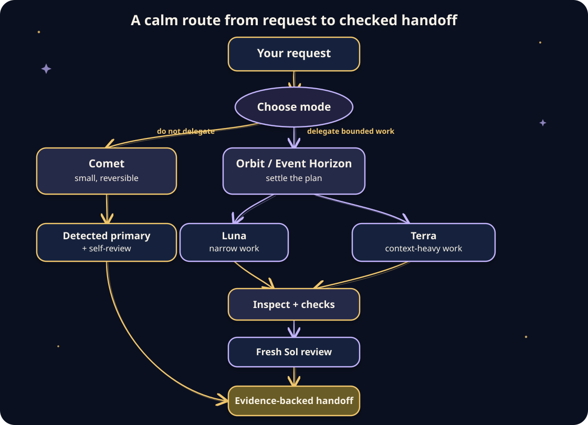
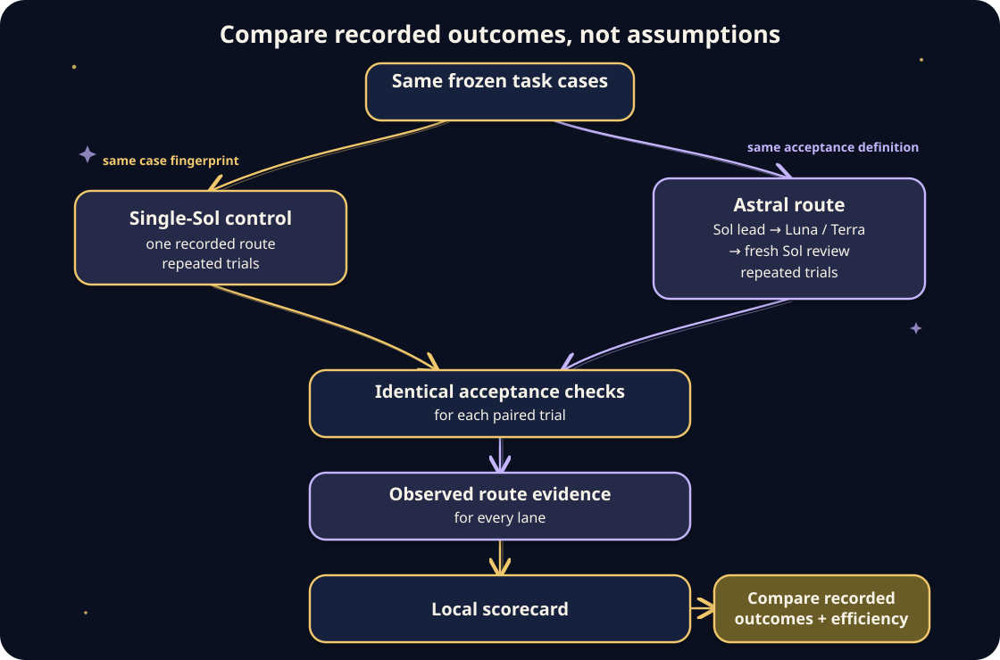

# Astral Orchestrator

Astral Orchestrator v3.2.0 is a published, installable, open-source Codex plugin. It
helps Codex turn an everyday request into a checked result: Sol stays responsible for
the plan and final decisions, Luna handles focused work, Terra handles context-heavy
implementation, and a fresh Sol reviewer checks the finished change.

It is published in this public repository for installation from a local marketplace.
Marketplace submission and review are separate, so it is not listed or endorsed by
Codex Marketplace.

## Quick Install

Paste this into Codex to install from the public repository:

~~~text
Install and set up Astral Orchestrator from https://github.com/Demonbane18/astral-orchestrator. Run sh scripts/setup.sh --dry-run first, then sh scripts/setup.sh. Preserve any conflicting agent profiles and run the package verification.
~~~

Or, from a terminal, copy and run:

~~~sh
git clone https://github.com/Demonbane18/astral-orchestrator.git
cd astral-orchestrator
sh scripts/setup.sh --dry-run
sh scripts/setup.sh
~~~

The dry run only prints the commands. The install registers this checkout as a local Codex
marketplace, adds the plugin, and installs three companion profiles without overwriting a
different file.

## What Astral Orchestrator does

Astral Orchestrator gives you a repeatable way to:

1. have Sol turn your request into a clear outcome and work plan;
2. send narrow, repeatable work to Luna and context-heavy implementation to Terra;
3. inspect the actual changes and run relevant checks;
4. request a fresh Sol review before handoff.

It works for code, documents, configuration, research artifacts, and other
workspace-based projects. It adds no API key, paid service, background server, analytics,
or third-party Python package. The only local runtime requirement beyond Codex is Python
3.11 or newer.

## Requirements

- Codex with access to gpt-5.6-sol, gpt-5.6-luna, and gpt-5.6-terra.
- Python 3.11 or newer; the included tools use only the Python standard library.
- A new Codex task after installation, so Codex can discover the plugin and profiles.

Setup installs profiles; it cannot grant access to models your Codex account does not
have. Astral Orchestrator stops instead of quietly choosing a different model or effort.

## Installation

### Codex-assisted

Open this complete repository in Codex and use the Quick Install prompt above. Codex can
run the dry run, installation, and verification for you. Installation changes your local
Codex configuration only after you run the non-dry command.

### Manual installation

Download the public repository as a ZIP or clone it, open a terminal in its root, and run:

~~~sh
sh scripts/setup.sh --dry-run
sh scripts/setup.sh
~~~

Do not install only the plugin folder: the repository-local marketplace file and the
three profiles are part of the setup.

## First use

Start a new Codex task with gpt-5.6-sol at your configured orchestrator effort (High by
default), then say:

~~~text
Use Astral Orchestrator to add a search box and verify every lane.
~~~

You can also ask it to fix an error or complete a documentation change. Guided mode is
the default, so you only need to name a mode when you want a different level of process.

For an evidence-oriented run, say “Use Astral Orchestrator in Measured mode.”

## Modes

| Mode | Best for | What happens |
|---|---|---|
| Quick | Tiny, obvious, easy-to-undo work | Sol works directly and self-reviews at the configured orchestrator effort. |
| Guided | Normal changes and projects | Sol plans, Luna or Terra implements bounded work, and fresh Sol reviews it. |
| Careful | Credentials, payments, private data, production, migrations, or major changes | Visible plan, confirmation gates, pinned workers, strict verification, and read-only reviewer evidence. |
| Measured (explicit opt-in) | A deliberately evidence-oriented request | Sol freezes one canonical card, records private local evidence, routes one pinned worker, and requests fresh Sol review. |

Astral Orchestrator raises safeguards when a request is riskier than the selected mode.
It does not broaden the work you asked for.
Measured is never automatic; Guided remains recommended for normal work.

## How Astral chooses models and effort

Three separate decisions keep the workflow predictable:

1. **Mode determines whether to delegate.** Quick keeps a tiny change in the Sol primary;
   Guided, Careful, and Measured delegate bounded implementation when there is work that can safely
   be handed off.
2. **Work characteristics choose Sol, Luna, or Terra.** Sol retains requirements,
   architecture, safety boundaries, and acceptance decisions. Luna receives narrow,
   repeatable, fully specified work. Terra receives context-heavy implementation,
   debugging, integrations, or moderate refactoring after Sol has settled the plan.
3. **Each lane reads its effort from the per-lane settings file.** Effort is not
   dynamically chosen from each prompt. Astral reads the configured orchestrator, Luna,
   Terra, and reviewer values before it runs, then either uses the matching profile or
   starts the exact pinned process. It stops if it cannot prove the requested model and
   effort; it does not substitute another route.

The route below is a documented **heuristic**, based on the type of work and the route
contract. The separate local outcome scorecard described below is how to collect
effectiveness and efficiency evidence without pretending that a single anecdote proves a
model choice.

## Measured instruction-context footprint

Using `tiktoken` 0.13.0 with the `o200k_base` encoding, the published v3.2.0 core
`SKILL.md` measures **1,974 tokens**; Quick measures **3,634 tokens**; Guided/full
measures **5,451 tokens**; and Measured measures **7,610 tokens**. Quick therefore
avoids **1,817 tokens (33.3%)** compared with eager full-bundle loading.

This measures instruction-context loading only. It does not prove every
multi-agent run uses fewer total tokens than a single Sol run, and it does not measure
outcome quality, latency, or price, or total tokens for a complete run. The committed
[context-footprint evidence](benchmarks/context-footprint-2026-08-04.json)
includes file hashes, byte/word/token counts, and a reproducible contributor command.

The reproducible pinned/state/evidence method was inspired by OpenRouter's Ori Eval;
see the [Ori Eval page](https://openrouter.ai/ori/eval) and
[spawn-ori-eval skill](https://openrouter.ai/skills/spawn-ori-eval). Astral Orchestrator
uses only pinned Codex GPT-5.6 Sol/Terra/Luna lanes; it does not run or depend on
Ori or OpenRouter.

## Configurable effort levels

Reasoning effort is the requested reasoning level/budget for a lane. Higher values can
increase latency and usage, and do not guarantee a better answer. Defaults stay
intentionally unchanged: Sol High for the orchestrator and reviewer, Luna XHigh, and
Terra XHigh.

Show the effective settings:

~~~sh
sh scripts/configure-effort.sh --show
~~~

Change one lane without changing the others:

~~~sh
sh scripts/configure-effort.sh --luna medium
~~~

Set multiple lanes or reset all defaults:

~~~sh
sh scripts/configure-effort.sh --orchestrator high --luna medium --terra high --reviewer high
sh scripts/configure-effort.sh --reset
~~~

Allowed values are minimal, low, medium, high, xhigh, max, and ultra. Max and ultra are
model-dependent and account-dependent. A rejected value is an error, never a silent
fallback. Settings persist at ~/.codex/astral-orchestrator/effort-levels.toml (or inside
CODEX_HOME when set), outside the plugin cache.

## How routing and verification work

[Open the editable Excalidraw source for the routing and verification diagram.](assets/diagrams/routing-and-verification.excalidraw)

Sol uses `gpt-5.6-sol`; Luna uses `gpt-5.6-luna`; Terra uses `gpt-5.6-terra`; and the
fresh reviewer uses `gpt-5.6-sol`. The configurable effort settings described above
supply each lane's effort (Sol High, Luna XHigh, Terra XHigh, reviewer Sol High by
default), rather than the prompt choosing a new effort at runtime.

For Guided, Careful, and Measured work, Astral Orchestrator first proves the installed profiles
match exactly and confirms the route. It uses native custom-agent selection only when
the host exposes the exact role; otherwise the included launcher starts a separate
Codex process pinned to the required model and configured effort. The launcher emits an
ASTRAL_ORCHESTRATOR_ROUTE header with allowlisted route facts, never the task packet,
instructions, secrets, or file contents.

A task name is not proof of the route. Missing or mismatched role, model, effort, or
review isolation blocks the lane and tells you the smallest corrective action.

Measured freezes exactly one canonical card and its checks before routing. If Luna versus
Terra is ambiguous, Sol sends exactly one behaviorally read-only probe to each lane with
the identical card; this is not hard sandbox isolation. The non-secret tracker files are
owner-only and resumable under a private `/tmp` path derived from effective UID plus
repository-root and frozen-card SHA-256 prefixes. Only the selected lane edits; fixes
need fresh verification and a new Sol reviewer.

## Benchmarking Astral against a single-Sol control

The repository includes a separate local, standard-library outcome scorecard. It does
not call Codex, send data anywhere, or manufacture a result: you run the same frozen task
cases, record the trial facts in JSONL, then ask the scorecard to validate and summarize
them. It is distinct from the instruction-context footprint above.

[Open the editable Excalidraw source for the outcome-scorecard diagram.](assets/diagrams/outcome-scorecard.excalidraw)

Quick start: create at least two JSONL records for every task case under each strategy
(the guide shows the exact schema), then run:

~~~sh
python3 plugins/astral-orchestrator/scripts/benchmark-scorecard.py benchmarks/trials.jsonl
python3 plugins/astral-orchestrator/scripts/benchmark-scorecard.py --format json benchmarks/trials.jsonl
~~~

The scorecard requires the same case fingerprint, matching repeated trials, and identical
acceptance checks for `single-sol` and `astral`. Within either strategy, its observed
route role/model/effort settings must remain fixed across repetitions; the two strategies
may intentionally differ. It reports success, first-pass acceptance, rework, route
correctness, wall time, and model calls; input/output token counts and a 0–100 quality
score are optional. Record quality scoring blind to strategy when practical. Read the
[benchmark guide and JSONL schema](benchmarks/README.md) before collecting trials.

The output can show what happened for the recorded cases and settings. It cannot prove
that Astral is generally faster, better, or cheaper, establish causation from a small
sample, or rescue a comparison with a wrong route or unequal acceptance checks. Treat a
route-correctness warning, a non-blind quality score, or a small/unrepresentative case
set as a reason to investigate before making a product claim.

## Safety and privacy

- Existing different agent profiles are never overwritten.
- Profile removal deletes only shipped files that still match exactly.
- Destructive, credential, publishing, production, and irreversible actions require
  an explicit confirmation gate in Careful mode.
- Work packets remain local. The exact-process route writes a private temporary packet,
  passes it only to the selected Codex process, then removes it after that process exits.
  There is no analytics collection, extra network client, API key, or background service.
- A fresh reviewer is required after worker-produced Guided or Measured work. Careful
  mode—and high-risk Measured work—also requires observed read-only review isolation.

## Updating and the 3.0 migration

To update a downloaded checkout, replace it with the newer complete repository and run:

~~~sh
sh scripts/setup.sh --refresh
~~~

Version 3.0.0 was a breaking identity migration from the former name, Project Pilot.
The plugin and marketplace IDs are now `astral-orchestrator`, profile filenames begin
with `astral-orchestrator-`, TOML agent names begin with `astral_orchestrator_`, route
evidence begins with `ASTRAL_ORCHESTRATOR_ROUTE`, and persistent settings live under
`~/.codex/astral-orchestrator/`. Install the new package; remove the former package
separately only when you no longer use it. Old effort settings are intentionally not
copied, so set desired values again with `configure-effort.sh`.

## Uninstalling

Remove the installed plugin:

~~~sh
codex plugin remove astral-orchestrator@astral-orchestrator
~~~

Remove the companion profiles only if they still exactly match the shipped versions:

~~~sh
sh plugins/astral-orchestrator/scripts/install-agents.sh --remove
~~~

Optionally remove this local marketplace entry:

~~~sh
codex plugin marketplace remove astral-orchestrator
~~~

These commands do not delete your downloaded repository or project files.

## Troubleshooting

| Problem | What to do |
|---|---|
| The plugin does not appear | Start a new Codex task, then run codex plugin list --marketplace astral-orchestrator. |
| Setup reports a profile conflict | Astral Orchestrator will not overwrite a customized profile. Compare it with the shipped profile, preserve any needed customization, then rerun setup. |
| A route cannot be proven | Run sh scripts/setup.sh --refresh, start a new Sol task at the shown effort, and do not request a fallback. |
| An effort value is rejected | Pick a supported value available to your account; max and ultra are not available everywhere. |
| Setup cannot find Codex or Python | Install or update Codex and use Python 3.11 or newer, then rerun the dry run. |

## Frequently asked questions

### Does this make Codex faster?

Not automatically. It makes non-trivial work more deliberate by selecting the right
pinned lane and demanding evidence before handoff.

### Can I use only one model?

Quick mode uses the verified Sol primary. Guided, Careful, and Measured require all three
specified models when bounded execution or independent review is needed; there is no
silent model substitution.

### Are my effort settings lost during an update?

No. They live outside the plugin cache at the Astral Orchestrator settings path. The
former Project Pilot settings path is deliberately separate because this release changes
the product identifier.

### Can I share this with a team?

Yes. Share the complete repository, then have each person run the Quick Install steps in
their own Codex environment. They need their own access to the three models.

## Sharing

The repository is public at https://github.com/Demonbane18/astral-orchestrator. Share
the link or a complete archive. Ask recipients to use the Codex-assisted installation
prompt or the manual setup commands; do not share an installed profile directory on its
own.

## Contributor commands

Run these from the repository root after a behavior or packaging change:

~~~sh
python3 -B -m unittest discover -s tests -v
sh plugins/astral-orchestrator/scripts/verify.sh
sh scripts/setup.sh --dry-run
git diff --check
~~~

The project does not add secrets, analytics, network runtime, or destructive setup.
Ask before publishing, pushing, or changing a user's global Codex configuration.

## License

Astral Orchestrator is distributed under the MIT License. See LICENSE.

## Sol Advisor attribution

Astral Orchestrator is an independent adaptation inspired by
[DannyMac180/sol-advisor](https://github.com/DannyMac180/sol-advisor), revision
92f0fb105854e0fa606bdc98bfe688411e1db989. The original Sol Advisor MIT notice and
copyright are preserved in NOTICE.md and LICENSE. Astral Orchestrator is not endorsed by
or affiliated with Daniel McAteer.
